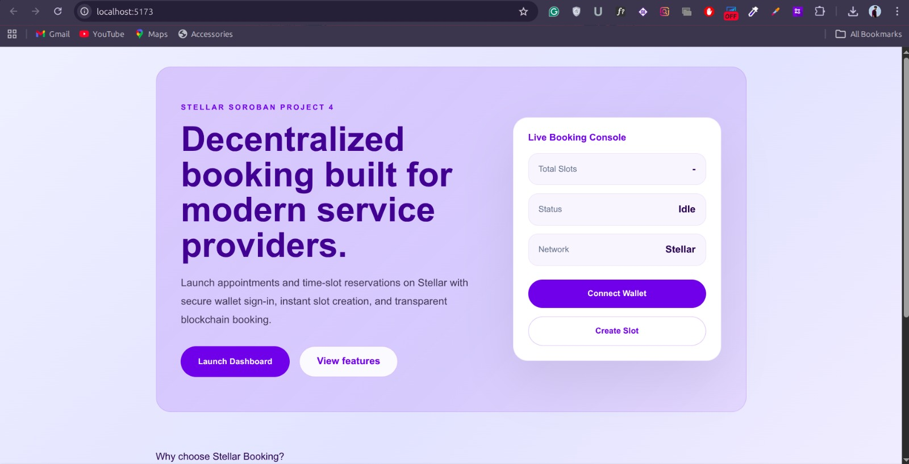
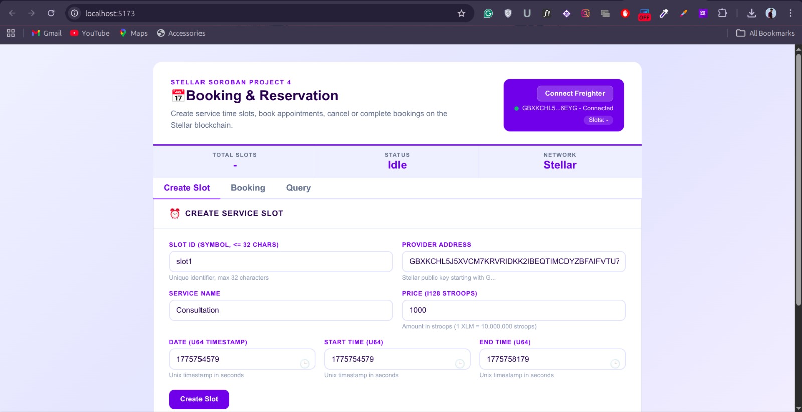
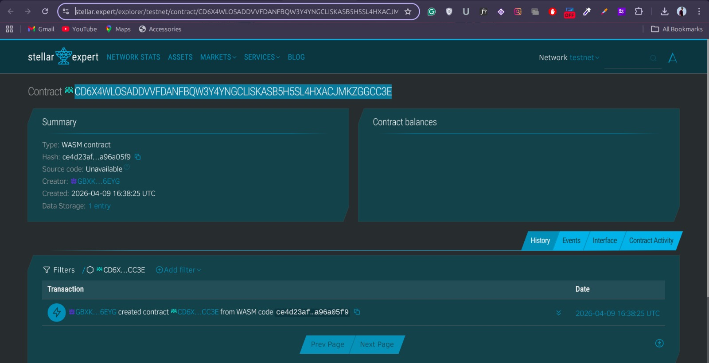

# 📘 Booking Reservation Smart Contract (Soroban)

A decentralized booking and reservation system built using the **Soroban SDK** on the **Stellar blockchain**. This smart contract allows service providers to create time slots and customers to book, cancel, and complete reservations securely.

---

## �️ Screenshots

### Landing Page



### Booking Dashboard



### Contract Explorer



[View deployed contract on Stellar Expert](https://stellar.expert/explorer/testnet/contract/CD6X4WLOSADDVVFDANFBQW3Y4YNGCLISKASB5H5SL4HXACJMKZGGCC3E)

---

## 🚀 Features

- 🗓️ Create service slots
- 📌 Book available slots
- ❌ Cancel bookings (by provider or customer)
- ✅ Mark bookings as completed
- 📊 Track total slots
- 📃 List all slot IDs
- 🔍 Fetch slot details

---

## 🏗️ Contract Structure

### 🔹 Slot

Represents a booking slot with the following fields:

| Field         | Type     | Description |
|--------------|----------|------------|
| provider     | Address  | Service provider |
| customer     | Address  | Customer who booked |
| is_booked    | bool     | Booking status |
| service_name | String   | Name of the service |
| date         | u64      | Date (timestamp or custom format) |
| start_time   | u64      | Start time |
| end_time     | u64      | End time |
| price        | i128     | Service price |
| status       | Symbol   | Current status |

---

### 🔹 Slot Status

- "available" → Slot is open
- "booked" → Slot is reserved
- "cancelled" → Booking cancelled
- "completed" → Service completed

---

## ⚠️ Errors

| Error | Description |
|------|------------|
| InvalidServiceName | Empty service name |
| InvalidTimeRange | Start time ≥ End time |
| NotFound | Slot not found |
| AlreadyExists | Slot ID already exists |
| AlreadyBooked | Slot already booked |
| NotBooked | Slot is not booked |
| Unauthorized | Caller not allowed |
| InvalidStatus | Invalid status transition |

---

## 📦 Functions

### 🟢 create_slot

Creates a new booking slot.

```rust
create_slot(
    env: Env,
    id: Symbol,
    provider: Address,
    service_name: String,
    date: u64,
    start_time: u64,
    end_time: u64,
    price: i128,
)
```

---

### 🔵 book_slot

Books an available slot.

```rust
book_slot(env: Env, id: Symbol, customer: Address)
```

---

### 🔴 cancel_booking

Cancels an existing booking.

```rust
cancel_booking(env: Env, id: Symbol, caller: Address)
```
```

---

### 🟣 complete_booking

Marks a booking as completed.

```rust
complete_booking(env: Env, id: Symbol, provider: Address)
```
```

---

### 🔍 get_slot

Fetch slot details.

```rust
get_slot(env: Env, id: Symbol) -> Option<Slot>
```
```

---

### 📃 list_slots

Returns all slot IDs.

```rust
list_slots(env: Env) -> Vec<Symbol>
```
```

---

### 📊 get_slot_count

Returns total number of slots.

```rust
get_slot_count(env: Env) -> u32
```
```

---

## 🧠 Storage Design

- Slot(Symbol) → Stores individual slot data
- IdList → Stores list of all slot IDs
- Count → Tracks total number of slots

---

## 🔐 Security

- Uses require_auth() for authorization
- Prevents:
  - Duplicate slot creation
  - Unauthorized actions
  - Invalid booking states

---

## 💡 Use Cases

- Appointment booking systems
- Service marketplaces
- Freelancer scheduling
- Salon / doctor slot booking
- Event reservations

---

## ⚙️ Tech Stack

- Rust (#![no_std])
- Soroban SDK
- Stellar Blockchain

---

## 📌 Future Improvements

- Payment integration
- Rating & reviews
- Time validation with real timestamps
- Recurring slots
- Notifications

---

## 🧑‍💻 Author

Built with ❤️ for Web3 and decentralized applications.
